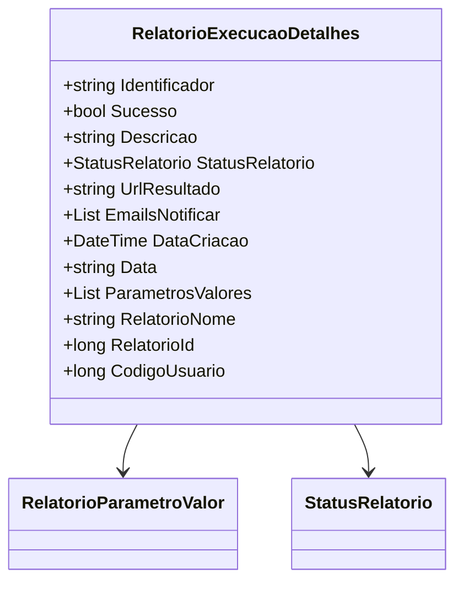

# RelatorioExecucaoDetalhes
**Namespace**: IsthmusWinthor.Dominio.Relatorios.Execucao  
**Nome do Arquivo**: RelatorioExecucaoDetalhes.cs  

## Visão Geral e Responsabilidade
A classe `RelatorioExecucaoDetalhes` é responsável por encapsular os detalhes de execução de um relatório. Ela inclui informações sobre o status da execução, identificação do relatório e parametração, resolvendo o problema de monitoramento e gestão de execuções de relatórios dentro do sistema.

## Propriedades Calculadas e de Validação
- **Data**: Esta propriedade calcula e formata a data de criação (`DataCriacao`) do relatório para o padrão "dd-MM-yyyy HH:mm". A regra por trás dessa propriedade é garantir que a data seja apresentada em um formato legível e padronizado para exibições em interfaces de usuário ou relatórios.

## Navigations Property
- **ParametrosValores**: Esta propriedade é uma lista de objetos que representam os valores dos parâmetros do relatório. O tipo complexo desta propriedade é `RelatorioParametroValor`, que pode ser encontrado em [RelatorioParametroValor](RelatorioParametroValor.md).

## Tipos Auxiliares e Dependências
- **StatusRelatorio**: Este enum é utilizado para indicar o status atual da execução do relatório. Mais informações podem ser encontradas em [StatusRelatorio](StatusRelatorio.md).

## Diagrama de Relacionamentos

---
Gerada em 29/12/2025 22:05:40
