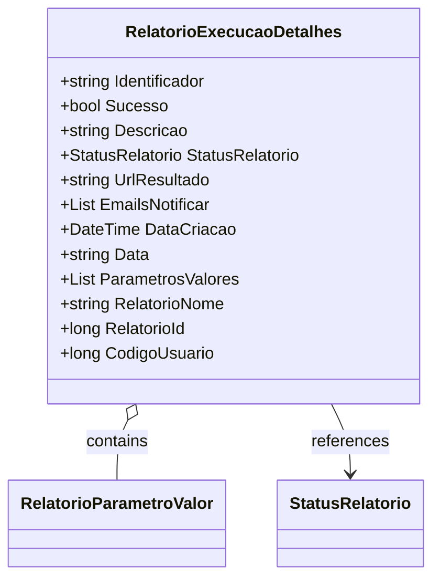

# RelatorioExecucaoDetalhes
- **Namespace**: IsthmusWinthor.Dominio.Relatorios.Execucao
- **Nome do Arquivo**: RelatorioExecucaoDetalhes.cs

> A classe `RelatorioExecucaoDetalhes` transporta informações detalhadas sobre a execução de relatórios, incluindo seu status, parâmetros e identificação.

## Propriedades Calculadas e de Validação
- **Data**: Esta propriedade calcula a representação da data de criação (`DataCriacao`) no formato "dd-MM-yyyy HH:mm". A regra aqui é garantir que a data seja apresentada de forma legível e padronizada para facilitar a visualização e interpretação por usuários.

## Navigations Property
- [RelatorioParametroValor](RelatorioParametroValor.md): Representa os valores dos parâmetros associados ao relatório.

## Tipos Auxiliares e Dependências
- [StatusRelatorio](StatusRelatorio.md): Enum que representa os diferentes status que um relatório pode ter.  

## Diagrama de Relacionamentos

