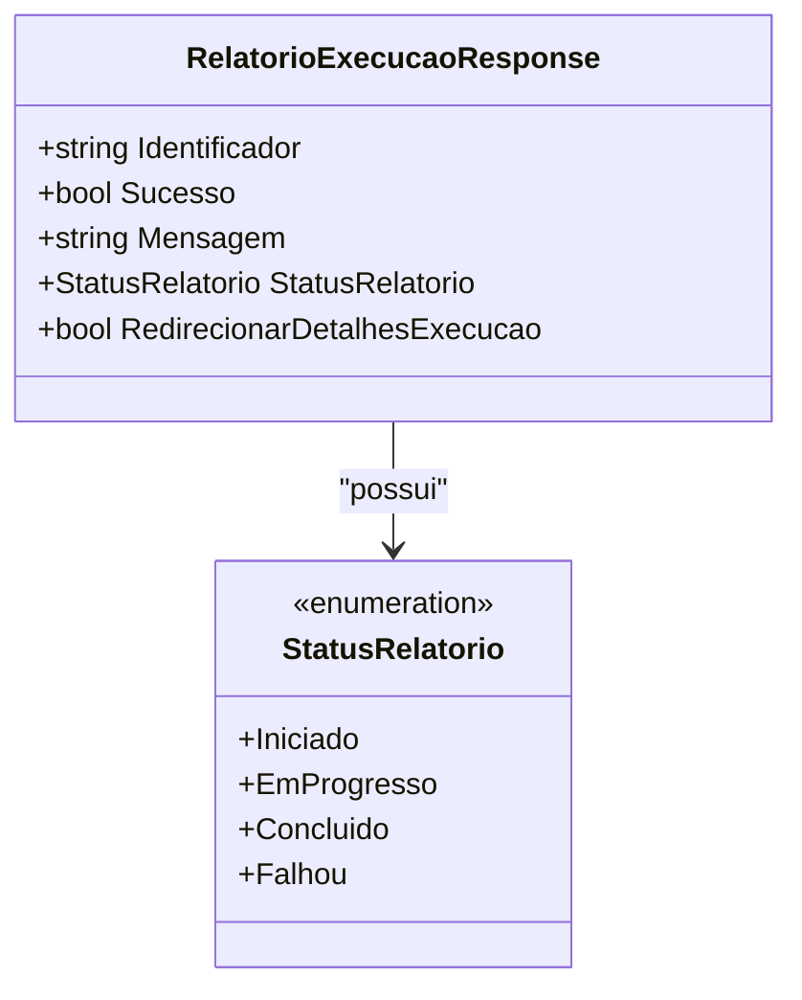

# RelatorioExecucaoResponse
**Namespace**: IsthmusWinthor.Dominio.Relatorios.Execucao  
**Nome do Arquivo**: RelatorioExecucaoResponse.cs  

### Visão Geral e Responsabilidade
A classe `RelatorioExecucaoResponse` é responsável por encapsular a resposta de um relatório de execução em um sistema corporativo. Ela atua como um modelo de dados que transporta informações sobre o estado da execução de um relatório, incluindo se a execução foi bem-sucedida e qual é a mensagem associada ao resultado da execução. O objetivo principal dessa classe é fornecer uma estrutura clara e organizada para o retorno de dados relacionados ao processo de execução de relatórios, facilitando a comunicação entre diferentes camadas do sistema.

### Propriedades Calculadas e de Validação
- **RedirecionarDetalhesExecucao**: Esta propriedade calculada verifica se o `StatusRelatorio` é igual a `StatusRelatorio.Iniciado`. Essa lógica garante que o sistema possa decidir se deve redirecionar para os detalhes da execução com base no status atual do relatório.

### Navigations Property
- `StatusRelatorio`: [StatusRelatorio](StatusRelatorio.md) - Enum que representa os diferentes status que um relatório pode ter durante a sua execução.

### Tipos Auxiliares e Dependências
- `StatusRelatorio`: [StatusRelatorio](StatusRelatorio.md) - Enum utilizado para determinar o estado atual do relatório.

### Diagrama de Relacionamentos

---
Gerada em 29/12/2025 22:05:55
