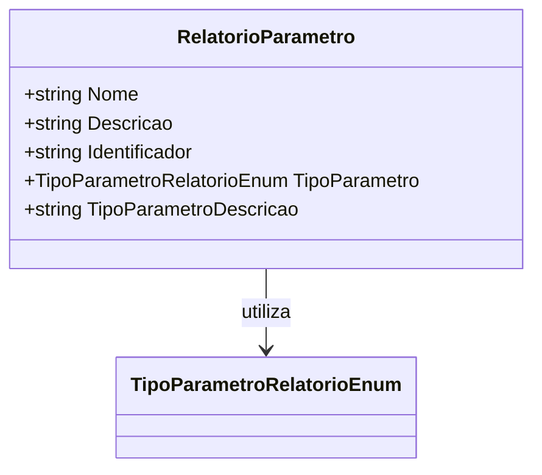

# RelatorioParametro
**Namespace**: IsthmusWinthor.Dominio.Relatorios.Execucao  
**Nome do Arquivo**: RelatorioParametro.cs  

### Visão Geral e Responsabilidade
A classe `RelatorioParametro` é responsável por encapsular os parâmetros que serão utilizados na execução de relatórios dentro do sistema. Cada parâmetro é identificado por um nome, uma descrição, um identificador único e um tipo de parâmetro, definindo assim a sua natureza e utilização. Essa estrutura é essencial para garantir que os relatórios sejam configuráveis e claramente definidos, permitindo uma operação eficiente e a personalização das saídas geradas.

### Métodos de Negócio
Esta classe não possui métodos com lógica de negócios, apenas propriedades que armazenam dados.

### Propriedades Calculadas e de Validação
- `TipoParametroDescricao`: Esta propriedade é uma representação textual do enum `TipoParametro`. Ela converte o valor do tipo de parâmetro em uma descrição legível, permitindo que o sistema apresente informações mais claras nos outputs de relatório.

### Navigations Property
- **Nenhuma propriedade complexa de domínio encontrada neste modelo.**

### Tipos Auxiliares e Dependências
- **Enumeradores:**
  - [TipoParametroRelatorioEnum](TipoParametroRelatorioEnum.md) 

### Diagrama de Relacionamentos

---
Gerada em 29/12/2025 22:06:11
