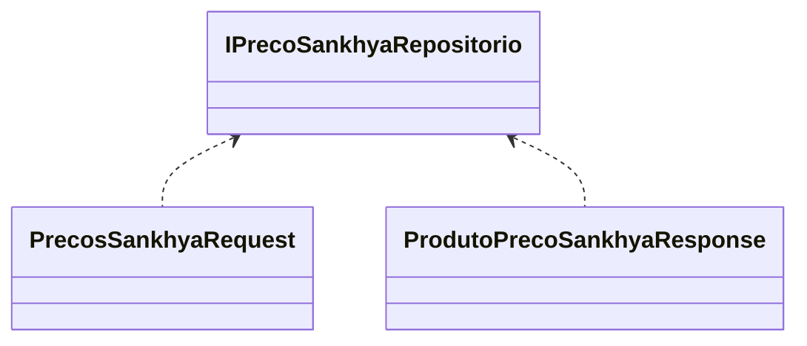

# IPrecoSankhyaRepositorio

**Namespace**: IsthmusWinthor.Infra.Sankhya  
**Nome do Arquivo**: IPrecoSankhyaRepositorio.cs

Esta interface serve como um contrato para a implementação de um repositório que lida com a busca de preços de produtos na plataforma Sankhya.

## Métodos de Negócio

### Título: Buscar (Público)
- **Objetivo**: Garante que a aplicação consiga recuperar a lista de preços de produtos baseada em uma distribuidora e um conjunto específico de critérios de preço.
- **Comportamento**:
  1. Recebe um `distribuidoraId` e um objeto `precosSankhyaRequest` que contém os critérios de busca.
  2. Executa uma operação de busca no repositório, filtrando os produtos de acordo com os parâmetros fornecidos.
  3. Retorna uma lista de respostas que contém os preços dos produtos encontrados, de acordo com a distribuidora especificada e os critérios de pesquisa.
- **Retorno**: Uma lista de objetos `ProdutoPrecoSankhyaResponse` que representa os preços dos produtos buscados.

## Tipos Auxiliares e Dependências

- **Enumeradores**: Nenhum listado.
- **Classes Estáticas/Helpers**:
  - [PrecosSankhyaRequest](PrecossankhyaRequest.md)
  - [ProdutoPrecoSankhyaResponse](ProdutoPrecoSankhyaResponse.md)

## Diagrama de Relacionamentos

---
Gerada em 29/12/2025 22:06:24
