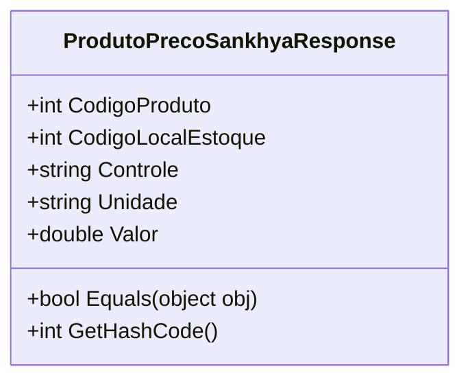

# ProdutoPrecoSankhyaResponse
- **Namespace**: IsthmusWinthor.Dominio.Sankhya.Model.Precos
- **Nome do Arquivo**: ProdutoPrecoSankhyaResponse.cs

## Visão Geral e Responsabilidade
A classe `ProdutoPrecoSankhyaResponse` é um modelo que representa a resposta contendo informações de preços de produtos provenientes de um sistema de gestão empresarial. Sua principal responsabilidade é servir como um contêiner para os dados que são convertidos de e para o formato JSON, permitindo a transferência eficiente de informações de preços e controle de estoque entre sistemas.

## Métodos de Negócio
### Título: Equals (public)
- **Objetivo**: Verificar a igualdade entre duas instâncias da classe `ProdutoPrecoSankhyaResponse`, garantindo que todos os campos relevantes sejam considerados na comparação.
- **Comportamento**:
  1. Recebe um objeto como parâmetro.
  2. Verifica se o objeto é do tipo `ProdutoPrecoSankhyaResponse`.
  3. Compara cada propriedade (`CodigoProduto`, `CodigoLocalEstoque`, `Controle`, `Unidade` e `Valor`) para determinar se as instâncias são equivalentes.
- **Retorno**: Retorna um valor booleano (`true` ou `false`) que indica se os objetos comparados são iguais.

### Título: GetHashCode (public)
- **Objetivo**: Gerar um código hash único para a instância da classe `ProdutoPrecoSankhyaResponse`, utilizando as propriedades significativas.
- **Comportamento**:
  1. Junta (combina) os valores das propriedades relevantes em um único inteiro.
  2. Utiliza a função `HashCode.Combine` para garantir que o hash gerado seja representativo da instância.
- **Retorno**: Retorna um inteiro que representa o código hash da instância, usado para otimizar comparações em coleções que dependem de hashing.

## Propriedades Calculadas e de Validação
Não existem propriedades com lógica no `get` ou validação no `set` nesta classe, já que todas são de simples armazenamento e não realizam qualquer tipo de cálculo ou validação adicional.

## Navigation Properties
Não existem propriedades que são classes complexas do domínio nesta classe, pois todas as propriedades são tipos primitivos ou simples.

## Tipos Auxiliares e Dependências
Não há enumeradores (Enums) ou classes estáticas/helpers que esta classe utilize diretamente.

## Diagrama de Relacionamentos

Esta documentação fornece uma visão clara das responsabilidades e regras de negócio da classe `ProdutoPrecoSankhyaResponse`, facilitando a sua compreensão dentro do contexto da aplicação.
---
Gerada em 29/12/2025 22:06:56
