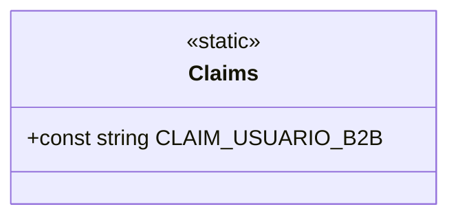

# Claims

**Namespace**: IsthmusWinthor.Dominio.Util  
**Nome do Arquivo**: Claims.cs  

A classe `Claims` é uma classe estática que serve como ponto central para definições de constantes relacionadas a permissões e reivindicações de usuário na aplicação. Ela facilita a gestão e o uso de constantes, garantindo que o acesso e as validações de usuários sejam feitos de maneira consistente em todo o sistema.

### Métodos de Negócio
- **Título**: `CLAIM_USUARIO_B2B` (Constante)
  - **Objetivo**: Define a reivindicação para usuários do tipo Business-to-Business (B2B), permitindo que o sistema reconheça e diferencie esse tipo de usuário em suas operações.
  - **Comportamento**: Esta constante é utilizada nas regras de autorização e autenticação para garantir que somente usuários B2B possam acessar recursos específicos. Sua utilização padroniza o código através da chamada dessa constante, evitando strings mágicas que podem levar a erros e facilitar a manutenção do código no futuro.
  - **Retorno**: A constante em si não retorna um valor executável, mas é uma chave que representa um tipo específico de usuário no sistema, tendo impacto direto nas funcionalidades de controle de acesso.

### Propriedades Calculadas e de Validação
Não há propriedades a serem listadas, uma vez que a classe `Claims` consiste apenas em constantes.

### Navigations Property
Não há propriedades navegacionais, já que a classe `Claims` é estática e não contém instâncias de classes complexas do domínio.

### Tipos Auxiliares e Dependências
- Embora esta classe não dependa de nenhum tipo auxiliar diretamente, ela pode ser referenciada em outros componentes do sistema que lidam com segurança e autorização.

### Diagrama de Relacionamentos

Este diagrama ilustra a `Claims` como uma classe estática, destacando a única constante definida que pode ser utilizada em outros componentes que necessitam realizar verificações ou validações relacionadas a usuários B2B.
