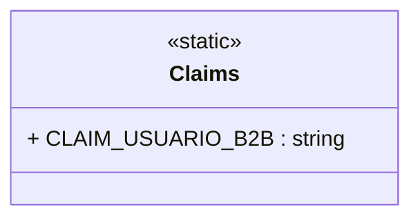

# Claims
**Namespace**: IsthmusWinthor.Dominio.Util  
**Nome do Arquivo**: Claims.cs  

Como uma classe estática, `Claims` é utilizada para centralizar e gerenciar as constantes relacionadas a identidades e permissões de usuários no contexto de um sistema de negócios B2B, facilitando a manutenção e a integração de regras de acesso.

## Métodos de Negócio
Não há métodos de negócio definidos além de constantes, logo, não são aplicáveis.

## Propriedades Calculadas e de Validação
Não existem propriedades com lógica de cálculo ou validação, pois a classe é composta apenas por constantes.

## Navigation Property
Não há classes complexas do domínio associadas a esta classe, pois ela serve apenas como um repositório para constantes.

## Tipos Auxiliares e Dependências
- Não existem enumeradores ou classes auxiliares/utilitárias adicionais referenciadas nesta classe.

## Diagrama de Relacionamentos

---
Gerada em 29/12/2025 22:07:02
