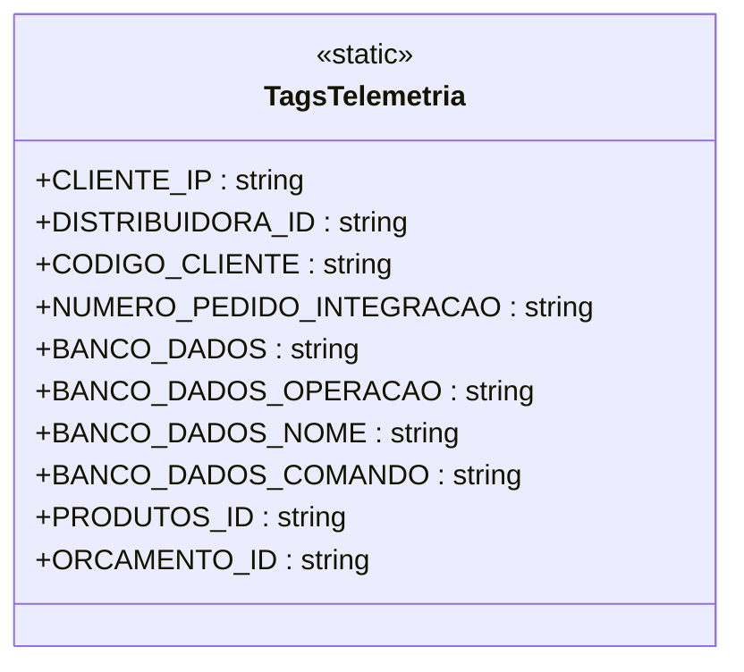

# TagsTelemetria
**Namespace**: IsthmusWinthor.Dominio.Util  
**Nome do Arquivo**: TagsTelemetria.cs  

Esta classe contém constantes que são utilizadas para categorizar e registrar informações relevantes no contexto de telemetria. Seu objetivo é assegurar a integridade e a uniformidade dos dados registrados durante operações no sistema, facilitando a coleta e a análise de métricas. 

### Métodos de Negócio
Esta classe é estática e não contém métodos de negócio, portanto, não há lógica processual para documentar.

### Propriedades Calculadas e de Validação
- Não existem propriedades na classe que possuam lógica no `get` ou validações no `set`, pois trata-se apenas de constantes.

### Navigations Property
- A classe não possui propriedades complexas de navegação, uma vez que contém apenas constantes.

### Tipos Auxiliares e Dependências
- Esta classe não depende de nenhum tipo auxiliar, enumerador ou classe estática fora de suas próprias definições.

### Diagrama de Relacionamentos

---
Gerada em 29/12/2025 22:07:13
