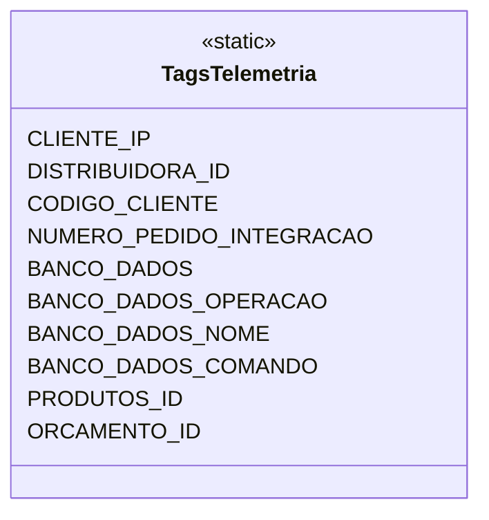

# TagsTelemetria
**Namespace**: IsthmusWinthor.Dominio.Util  
**Nome do Arquivo**: TagsTelemetria.cs  

> A classe `TagsTelemetria` serve como um repositório centralizado de constantes que representam tags de telemetria utilizadas em todo o sistema para identificar e categorizar diversos dados nas interações dos usuários e operações do banco de dados.

## Métodos de Negócio
- **Título**: N/A (Classe somente estática)
- **Objetivo**: Esta classe não possui métodos de negócio complexos, pois é composta apenas por constantes. Portanto, não há regras de negócio a garantir.

## Propriedades Calculadas e de Validação
- N/A

## Navigations Property
- N/A

## Tipos Auxiliares e Dependências
- N/A

## Diagrama de Relacionamentos

